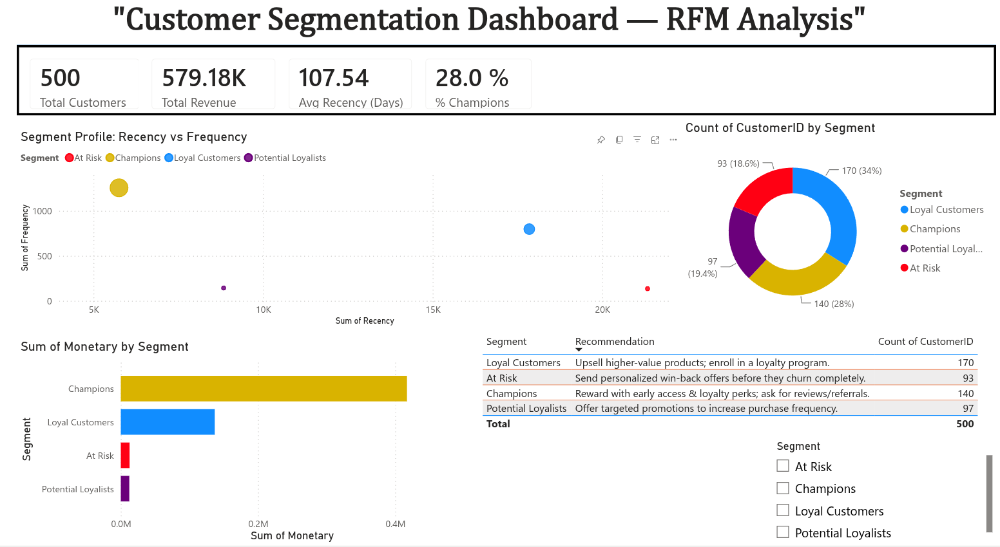
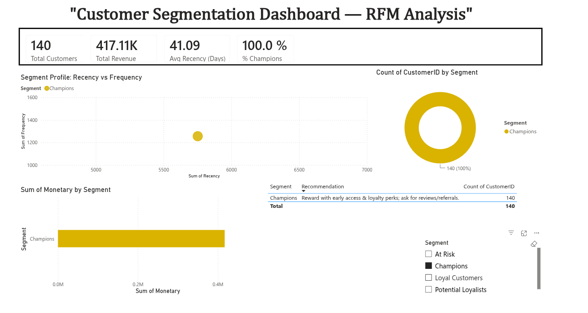
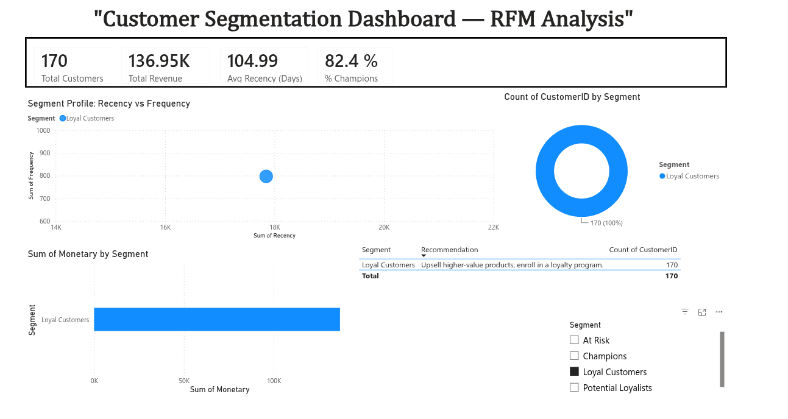
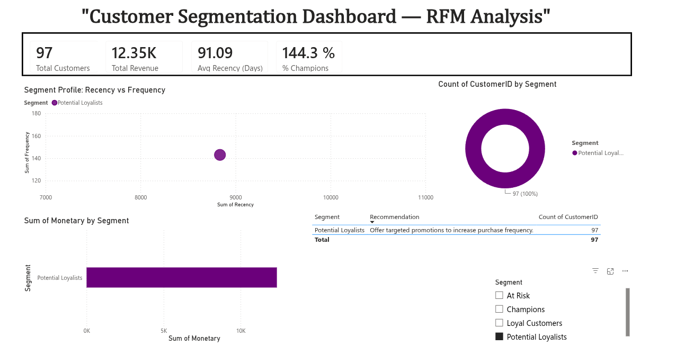
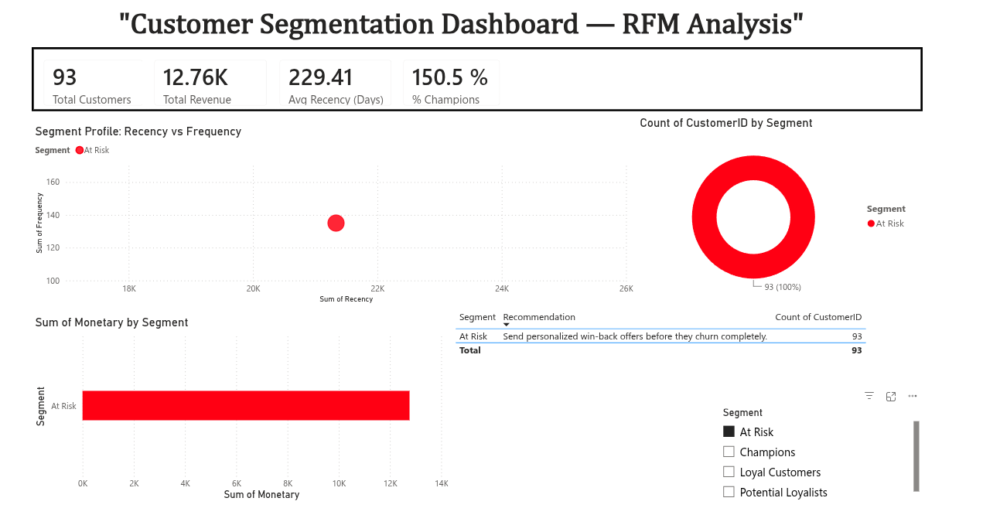

# Customer Segmentation & Sales Insights Dashboard

An end-to-end customer segmentation project: raw transaction data → EDA →
RFM (Recency, Frequency, Monetary) feature engineering → K-Means clustering
→ business-labeled customer segments with retention recommendations →
interactive Power BI dashboard.



## Overview

Retail businesses generate huge volumes of transaction data but often
struggle to translate it into action. This project takes raw invoice-level
transaction data and turns it into four clear customer segments —
**Champions, Loyal Customers, Potential Loyalists, At Risk** — each paired
with a specific retention recommendation, visualized in a live Power BI
dashboard.

## Tech Stack
`Python` · `Pandas` · `NumPy` · `scikit-learn` · `Matplotlib` · `Power BI`

## Project Structure


customer-segmentation/

├── data/

│   └── retail_transactions.csv            

├── outputs/

│   ├── eda_monthly_revenue.png

│   ├── eda_revenue_by_country.png

│   ├── eda_top_products.png

│   ├── kmeans_k_selection.png            

│   ├── segment_counts.png

│   ├── segment_revenue.png

│   ├── segment_scatter.png

│   └── customer_segments_for_powerbi.csv  

├── powerbi/

│   ├── CustomerSegmentationDashboard.pbix   

│   └── screenshots/

│       ├── dashboard_overview.png

│       ├── segment_breakdown.png

│       └── revenue_by_segment.png

├── rfm_clustering.py                   

├── requirements.txt

└── README.md

## How the Pipeline Works

1. **Load & Clean** — reads the transaction CSV (auto-handles both UTF-8 and
   Latin-1/cp1252 encodings, and normalizes column-naming differences
   between dataset versions e.g. `Invoice`/`InvoiceNo`, `Price`/`UnitPrice`).
   Drops rows with missing customer IDs and removes cancelled orders.
2. **EDA** — monthly revenue trend, revenue by country, top products by revenue.
3. **RFM Feature Engineering** — computes per customer:
   - **Recency**: days since their last purchase
   - **Frequency**: number of distinct orders
   - **Monetary**: total amount spent
4. **K-Means Clustering** — log-transforms Frequency/Monetary to reduce skew,
   standardizes all three features, then clusters with `k` auto-selected via
   silhouette score across a business-meaningful range (k = 3–6, avoiding a
   trivial 2-cluster split).
5. **Segment Labeling** — ranks clusters by a composite RFM score and maps
   them to business-friendly names, each with a tailored retention action.
6. **Export** — writes `outputs/customer_segments_for_powerbi.csv`, one row
   per customer: `CustomerID, Recency, Frequency, Monetary, Segment, Recommendation`.

## Running the Pipeline

```bash
pip install -r requirements.txt
python rfm_clustering.py         # runs EDA + RFM + clustering, writes outputs/
```

### Using a real dataset
This project works out of the box with **Online Retail II**
(UCI/Kaggle), the standard benchmark dataset for RFM segmentation research:
- ~5,850 customers, ~398,000 transactions, UK-based online retailer, 2009–2011.

Just replace `data/retail_transactions.csv` with the downloaded file and
re-run `python rfm_clustering.py` — no manual column renaming needed, the
loader normalizes both dataset versions automatically.

## The Power BI Dashboard

Built on top of `customer_segments_for_powerbi.csv`, the dashboard includes
KPI cards (Total Customers, Total Revenue, Avg Recency, % Champions), a
segment breakdown donut chart, a revenue-by-segment bar chart, a segment
profile scatter chart, and a recommendations table.

📂 [Download the .pbix file](powerbi/CustomerSegmentationDashboard.pbix)

### Full Dashboard


### Segment Breakdown

**Champions** — highest frequency & spend, most recent purchases. Reward
with early access & loyalty perks; ask for reviews/referrals.


**Loyal Customers** — consistent repeat buyers. Upsell higher-value
products; enroll in a loyalty program.


**Potential Loyalists** — recent but infrequent buyers. Offer targeted
promotions to increase purchase frequency.


**At Risk** — long recency gap, declining engagement. Send personalized
win-back offers before they churn completely.


### Key DAX Measures
```dax
Total Customers = COUNTROWS('customer_segments_for_powerbi 1')

Total Revenue = SUM('customer_segments_for_powerbi 1'[Monetary])

Avg Recency (Days) = AVERAGE('customer_segments_for_powerbi 1'[Recency])

% Champions =
DIVIDE(
    CALCULATE(COUNTROWS('customer_segments_for_powerbi 1'), 'customer_segments_for_powerbi 1'[Segment] = "Champions"),
    COUNTROWS('customer_segments_for_powerbi 1')
)

Revenue at Risk =
CALCULATE(
    SUM('customer_segments_for_powerbi 1'[Monetary]),
    'customer_segments_for_powerbi 1'[Segment] IN {"At Risk", "Needs Attention", "Hibernating", "Lost"}
)
```

## Sample Findings (synthetic data)
- 500 customers, ~2,300 orders, ~$579K total revenue
- 4 segments identified via K-Means (silhouette-optimized k=4): **Champions**,
  **Loyal Customers**, **Potential Loyalists**, **At Risk**
- Champions make up ~28% of customers but contribute a disproportionate
  share of total revenue — a classic Pareto pattern, and the dashboard's
  clearest actionable insight for a retention/marketing team.

## Author
**Gandharv Pandey** — [GitHub](https://github.com/xenonat54) · [Portfolio](https://gandharv-portfolio-nu.vercel.app/) · [LinkedIn](https://in.linkedin.com/in/gandharv-pandey)
